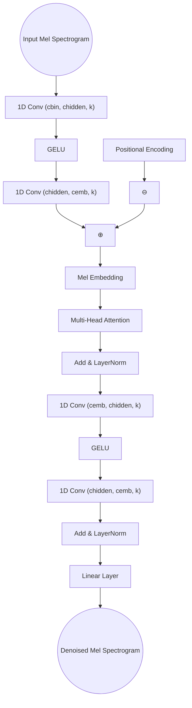

```mermaid
graph TD
    A((Input Mel Spectrogram)) --> B["1D Conv (cbin, chidden, k)"]
    B --> C["GELU"]
    C --> D["1D Conv (chidden, cemb, k)"]
    
    %% Summation Node (+ inside a circle)
    D -->E[⊕] 
    PE["Positional Encoding"] --> PE2[⊖] --> E 

    %% After summation
    E --> F["Mel Embedding"]
    F --> G["Multi-Head Attention"]
    G --> H["Add & LayerNorm"]
    H --> I["1D Conv (cemb, chidden, k)"]
    I --> J["GELU"]
    J --> K["1D Conv (chidden, cemb, k)"]
    K --> L["Add & LayerNorm"]
    L --> N["Linear Layer"]
    N --> O((Denoised Mel Spectrogram))
```